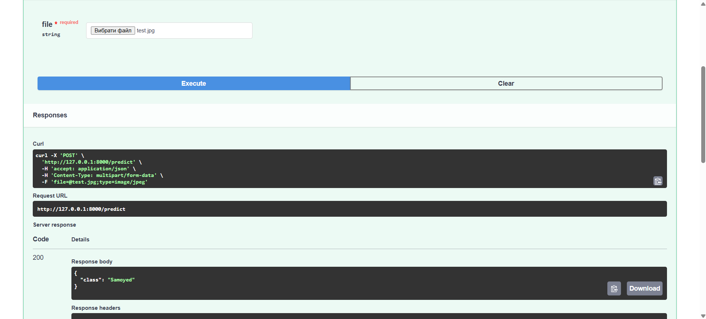
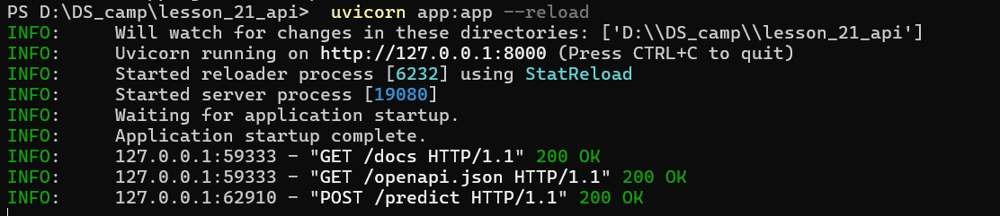

# Computer Vision API with ResNet50

## Overview

This project is a simple Computer Vision solution deployed as a REST API using FastAPI. The API performs image classification by receiving an image from a client, processing it with a pre-trained ResNet50 neural network, and returning the predicted object class.

---

## Project Structure

```text
lesson_21_api/
│
├── app.py
├── requirements.txt
├── README.md
└── test.jpg
```

---

## Deployment Information

The model is deployed as a REST API using FastAPI.

Technology stack:

- Python 3.10+
- FastAPI
- Uvicorn
- PyTorch
- Torchvision
- Pillow

The API accepts image files via HTTP POST requests and returns classification results in JSON format.

---

## Installation Instructions

### 1. Clone the repository

```bash
git clone <repository_url>
cd lesson_21_api
```

### 2. Create a virtual environment

Windows:

```bash
python -m venv venv
venv\Scripts\activate
```

Linux/macOS:

```bash
python3 -m venv venv
source venv/bin/activate
```

### 3. Install dependencies

```bash
pip install -r requirements.txt
```

### 4. Run the application

```bash
uvicorn app:app --reload
```

## Requirements

Сontained in `requirements.txt`

---

## Modeling Information

### Model

ResNet50 (Residual Network 50)

### Framework

PyTorch

### Task

Image Classification

### Model Description

ResNet50 is a deep Convolutional Neural Network (CNN) introduced by Microsoft Research in 2015. The model consists of 50 layers and uses residual connections (skip connections) to overcome the vanishing gradient problem and improve training of deep neural networks.

The network was pre-trained on the ImageNet dataset, which contains over 14 million images belonging to 1000 object categories.

### Input

- RGB image
- Size: 224 × 224 pixels

### Output

- Predicted object class
- Confidence score (optional)

### Model Characteristics

Architecture: ResNet50
Framework: PyTorch
Input Size: 224×224
Classes: 1000
Dataset: ImageNet

### Advantages

- High classification accuracy
- Pre-trained weights available
- Easy integration into web services
- Suitable for educational and demonstration purposes

### Limitations

- Recognizes only ImageNet classes
- Requires more computational resources than lightweight models
- Not optimized for mobile deployment

---

## Interface Description

### Base URL

```text
http://127.0.0.1:8000
```

---

#### Request

```http
POST /predict
```

#### Description

Receives an image file and returns the predicted object class.

## API Workflow

1. Client uploads an image.
2. FastAPI receives the image.
3. The image is converted to RGB format.
4. The image is resized to 224×224 pixels.
5. The image is transformed into a tensor.
6. ResNet50 processes the image.
7. The class with the highest probability is selected.
8. The API returns the predicted label as JSON.

---

## Screenshots

Add screenshots demonstrating:

### Successful Prediction




### Server Logs



## Conclusion

This project demonstrates deployment of a computer vision model as a REST API using FastAPI and PyTorch. A pre-trained ResNet50 network performs image classification, while FastAPI provides a simple and efficient interface for client interaction. The solution can be extended with additional endpoints, custom-trained models, confidence scores, or object detection functionality.# DS_camp