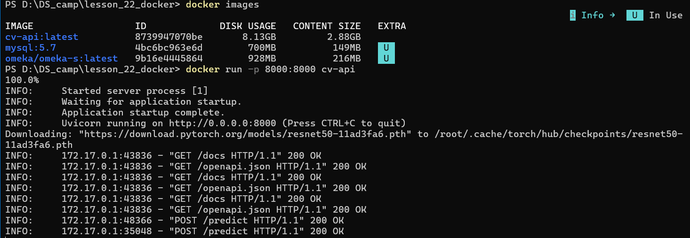
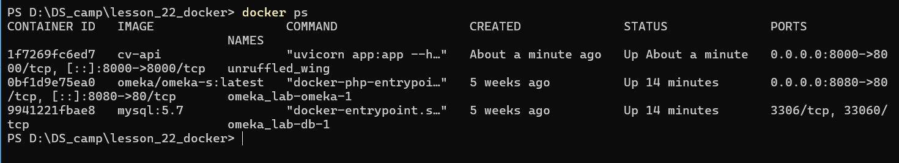
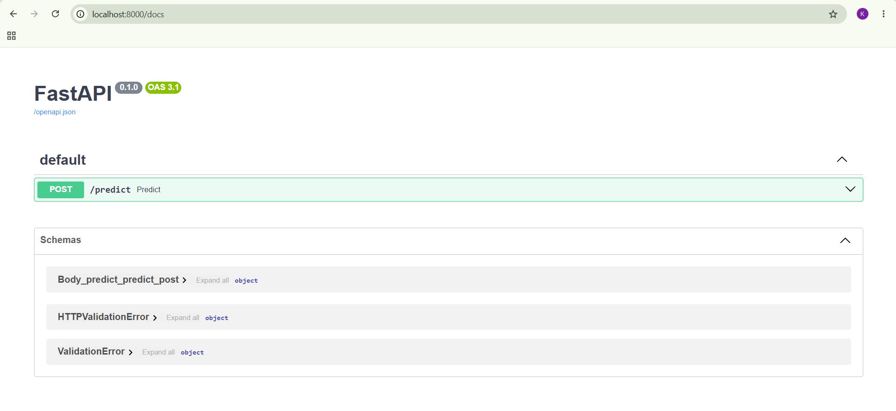
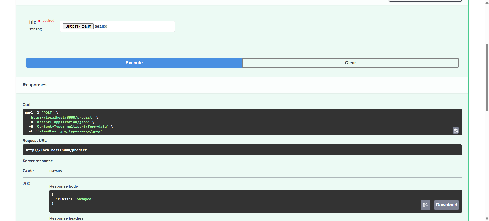

# Computer Vision API Docker Deployment

## Overview

This project demonstrates deployment of a Computer Vision application as a Docker container. The application is implemented as a REST API using FastAPI and performs image classification using a pre-trained ResNet50 neural network from PyTorch. Users can upload an image through the API and receive the predicted object class in JSON format.

## Technology Stack

- Python 3.11
- FastAPI
- Uvicorn
- PyTorch
- Torchvision
- Pillow
- Docker

## Project Structure

```text
lesson_22_docker/
│
├── app.py
├── requirements.txt
├── Dockerfile
├── README.md
└── screenshots/
    ├── container-logs.png
    ├── docker-ps.png
    ├── swagger.png
    └── prediction.png
```

## Installation

### Clone the repository

```bash
git clone <repository_url>
cd cv-api
```

### Build Docker image

```bash
docker build -t cv-api .
```

### Run Docker container

```bash
docker run -p 8000:8000 cv-api
```

## Build Process

Build Docker image:

```bash
docker build -t cv-api .
```

## Running the Container

Start the container:

```bash
docker run -p 8000:8000 cv-api
```

### Screenshot



## Checking Running Containers

Use:

```bash
docker ps
```

### Screenshot



## ENTRYPOINT and CMD

The Docker image is configured with ENTRYPOINT and CMD.

```dockerfile
ENTRYPOINT ["uvicorn", "app:app"]
CMD ["--host", "0.0.0.0", "--port", "8000"]
```

By default Docker executes:

```bash
uvicorn app:app --host 0.0.0.0 --port 8000
```

Custom arguments can be passed during container startup.

Example:

```bash
docker run -p 9000:9000 cv-api --host 0.0.0.0 --port 9000
```

Resulting command:

```bash
uvicorn app:app --host 0.0.0.0 --port 9000
```

This demonstrates how runtime arguments can be supplied through the `docker run` command.

## Model Information

### Model

ResNet50 (Residual Network 50)

### Framework

PyTorch

### Task

Image Classification

### Description

ResNet50 is a deep convolutional neural network consisting of 50 layers. It uses residual connections (skip connections) to improve training performance and accuracy.

The model was pre-trained on the ImageNet dataset containing over 14 million images and 1000 object categories.

### Input

- RGB image
- 224 × 224 pixels

### Output

- Predicted object class

## API Interface

### Base URL

```text
http://localhost:8000
```

### Endpoint

#### POST /predict

Accepts an image file and returns the predicted class.

##### Request

Content-Type:

```text
multipart/form-data
```

## Swagger Documentation

The API automatically generates Swagger documentation.

URL:

```text
http://localhost:8000/docs
```

### Screenshot



## Example Prediction

### Input Image

Upload an image through Swagger UI or using a curl request.

### Screenshot



## Example Workflow

1. Build the Docker image.
2. Run the Docker container.
3. Open Swagger UI.
4. Upload an image.
5. Execute the request.
6. Receive the predicted class.
7. Verify logs and running container.

## Conclusion

This project demonstrates deployment of a Computer Vision model using Docker and FastAPI. The application exposes a REST API that performs image classification using a pre-trained ResNet50 model. Docker enables easy deployment and execution of the application in a portable and reproducible environment.